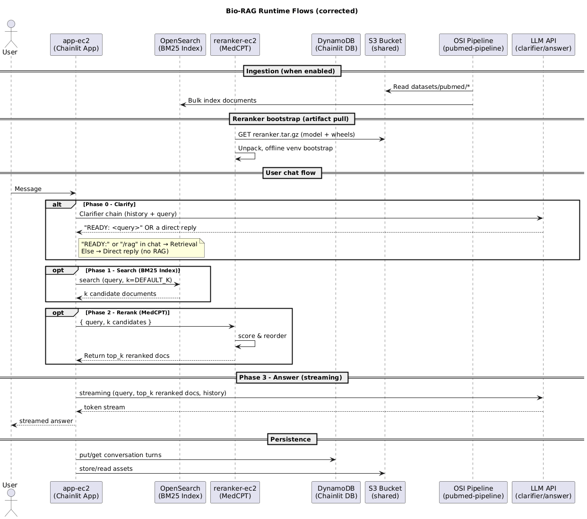

# LangChain App (Bio-RAG)

## 📘 Overview

This repository contains the **application logic** for Bio-RAG.  
It runs as a **Chainlit web app** on the App EC2 instance provisioned by the [Bio-RAG infra](../).

The app implements a **Clarify-then-RAG** sequence:

1. **Clarifier Phase** – LLM decides if a query is ready for retrieval or requires clarification.
2. **Search Phase** – retrieves candidates from OpenSearch.
3. **Reranker Phase** – sends candidates to the Reranker service (GPU EC2).
4. **Answer Generation** – streams the final answer back to the user with cited sources.

---

## 🏗 Sequence Diagram

The diagram below illustrates the main runtime flow between user, app, OpenSearch, reranker, and LLM:

---

## 🎥 Demo

Here’s Bio-RAG in action answering a biomedical question:

---

## ⚙️ Configuration

The app behavior is controlled via environment variables (set on the EC2 instance):

| Variable                  | Default     | Description                                        |
| ------------------------- | ----------- | -------------------------------------------------- |
| `AWS_REGION`              | `us-east-1` | AWS region for DynamoDB & S3 clients               |
| `CHAINLIT_TABLE`          | —           | DynamoDB table name (required)                     |
| `CHAINLIT_BUCKET`         | —           | S3 bucket name for Chainlit storage (required)     |
| `CHAINLIT_ADMIN_PASSWORD` | unset       | Optional admin password for basic auth             |
| `SEARCH_K`                | `50`        | Number of initial retrieval candidates             |
| `TOP_K`                   | `10`        | Number of reranked candidates used                 |
| `CHAT_HISTORY_TURNS`      | `6`         | How many past turns to include in context          |
| `ALWAYS_RAG`              | `false`     | If `true`, skip clarifier and always run retrieval |
| `READY_PREFIX`            | `READY:`    | Prefix the clarifier uses to signal retrieval      |

---

## 🔗 Related Repository

- [Bio-RAG (infra)](https://github.com/wnkinc/Bio-RAG?tab=readme-ov-file) – AWS infrastructure (Pulumi) that provisions the VPC, EC2 instances, OpenSearch domain, and DynamoDB/S3 used by this app.
